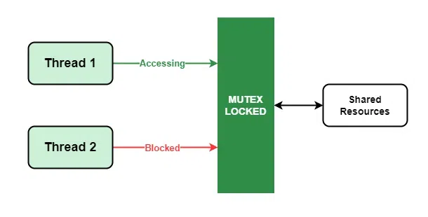

# Matrix Multiplication Performance Analysis

## Project Overview
This project aims to analyze the performance of matrix multiplication using three different methods: numpy, single-threaded, and multi-threaded with mutex locks. The primary goal is to compare the efficiency and correctness of these methods.

## Table of Contents
1. [Project Overview](#project-overview)
2. [What is Mutex and Acquire Function](#what-is-mutex-and-acquire-function)
3. [Single-threaded Matrix Multiplication](#single-threaded-matrix-multiplication)
4. [Matrix Generator](#matrix-generator)
5. [Analysis of Reports](#analysis-of-reports)
6. [Conclusion](#conclusion)

## What is Mutex and Acquire Function
A **mutex** (mutual exclusion) is a synchronization primitive used to prevent concurrent threads from accessing shared resources simultaneously. It ensures that only one thread can access the resource at any given time, thereby avoiding race conditions.


### Implementation in Project
In this project, the mutex is implemented using the `ctypes` library to create a compare-and-swap function. The `Mutex` class has `acquire` and `release` methods to manage the lock state. Threads use the `acquire` method to lock the mutex before accessing shared resources and `release` to unlock it afterward.

```python
class Mutex:
    def __init__(self):
        self.lock = ctypes.pointer(c_int(0))

    def acquire(self):
        while True:
            if compare_and_swap(self.lock, 0, 1):
                return

    def release(self):
        self.lock.contents.value = 0
```

## Single-threaded Matrix Multiplication
The single-threaded matrix multiplication method involves straightforward nested loops to perform the matrix multiplication. Each element of the resulting matrix is computed one by one without any parallelization.


```python
def single_thread_matrix_multiply(A, B):
    assert A.shape[1] == B.shape[0], "Incompatible matrices for multiplication"
    C = np.zeros((A.shape[0], B.shape[1]), dtype=int)
    for i in range(A.shape[0]):
        for j in range(B.shape[1]):
            sum = 0
            for k in range(A.shape[1]):
                sum += A[i, k] * B[k, j]
            C[i, j] = sum
    return C
```

## Matrix Generator
The matrix generator is responsible for creating random matrices and saving them to files. This is achieved using numpy to generate random integers, and the matrices are written to text files.

```python
def generate_and_save_matrices(matrix_size_A, matrix_size_B, file_path_A, file_path_B):
    os.makedirs(os.path.dirname(file_path_A), exist_ok=True)
    os.makedirs(os.path.dirname(file_path_B), exist_ok=True)

    matrix_A = np.random.randint(10, size=(matrix_size_A, matrix_size_B))
    matrix_B = np.random.randint(10, size=(matrix_size_B, matrix_size_A))

    with open(file_path_A, 'w') as file_A:
        for row in matrix_A:
            file_A.write(' '.join(map(str, row)) + '\n')

    with open(file_path_B, 'w') as file_B:
        for row in matrix_B:
            file_B.write(' '.join(map(str, row)) + '\n')
```

## Analysis of Reports
The following data summarizes the time taken by each method over 100 iterations for:

### $A_{300 \times 400}$ $\times$ $B_{400 \times 300}$

- **Average numpy matrix multiplication time:** 0.0253 seconds
- **Average threaded matrix multiplication time:** 7.9636 seconds
- **Average single-threaded matrix multiplication time:** 7.6882 seconds

### Iteration Reports
Here is an example of the detailed report for each iteration:

```
Iteration 1
Time using numpy: 0.0285 seconds
Threaded matrix multiplication time: 7.5576 seconds
Single-threaded matrix multiplication time: 8.9681 seconds
...
Iteration 100
Time using numpy: 0.0120 seconds
Threaded matrix multiplication time: 7.8053 seconds
Single-threaded matrix multiplication time: 7.6021 seconds
```

## Conclusion
### Performance Analysis
#### Why numpy Works Very Well
Numpy performs very well for matrix multiplication due to several reasons:
1. **Optimized Libraries:** Numpy leverages highly optimized libraries like BLAS (Basic Linear Algebra Subprograms) and LAPACK (Linear Algebra Package), which are written in low-level languages like C and Fortran. These libraries are specifically designed for efficient numerical computations.
2. **Hardware Acceleration:** Numpy can utilize hardware acceleration features available on modern CPUs, such as vectorized operations and parallel processing, to speed up computations.
3. **Memory Efficiency:** Numpy uses contiguous memory blocks and optimized memory access patterns, reducing cache misses and improving data access speeds.
4. **Algorithm Optimization:** Numpy implements highly efficient algorithms for matrix multiplication, taking advantage of mathematical properties and advanced techniques to minimize computation time.

#### Overhead of Thread Management
The threaded implementation does not show a significant improvement over the single-threaded method due to several reasons:
1. **Thread Creation and Management:** Creating and managing multiple threads incurs overhead. Each thread requires its own stack space and resources, leading to increased memory usage and context-switching overhead.
2. **Mutex Locking:** The use of mutex locks to ensure thread safety adds synchronization overhead. Threads spend time waiting for locks to be acquired and released, which can negate the benefits of parallelism.
3. **GIL (Global Interpreter Lock):** In CPython, the Global Interpreter Lock (GIL) ensures that only one thread executes Python bytecode at a time, limiting the potential for true parallelism in multi-threaded Python programs.
4. **Granularity of Tasks:** Matrix multiplication involves fine-grained tasks where each element calculation is relatively quick. The overhead of managing threads and locks can overshadow the benefits of parallel execution for such fine-grained tasks.

#### Why Numpy is Better Than Both Threaded and Single-threaded Methods
1. **Efficiency of Optimized Libraries:** Numpy's use of optimized libraries and hardware acceleration results in much faster computations compared to manually implemented methods.
2. **Reduced Overhead:** Numpy's matrix multiplication avoids the overhead associated with thread creation, context switching, and mutex locking, leading to more efficient execution.
3. **Parallelism and Vectorization:** Numpy can take advantage of low-level parallelism and vectorized operations, providing significant speedup compared to high-level threading in Python.

### Final Thoughts
The results highlight the importance of choosing the right tool for the job. While threading can be beneficial in many scenarios, numpy's optimized operations are more suitable for matrix multiplication tasks, demonstrating superior performance.
